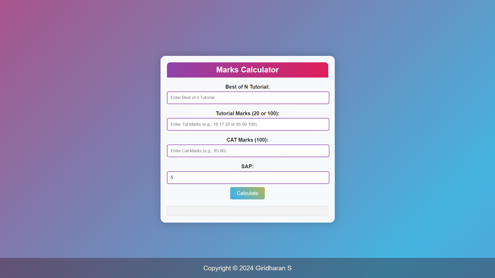
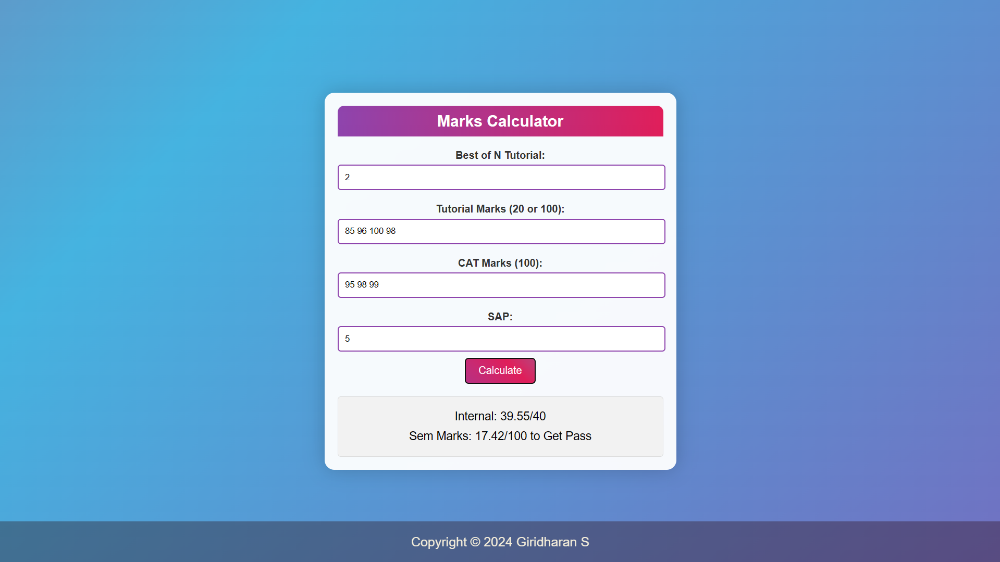

# Internal and External Marks Calculator 🎓

Calculate internal and external marks based on tutorial and CAT scores for college assessments.

## Description ℹ️

This project allows users to input tutorial and CAT (Continuous Assessment Test) scores to calculate internal and external marks required for college assessments. It provides a clear breakdown of total marks and external marks needed to achieve a passing grade.

## Features ✨

- Input fields for tutorial marks, CAT marks, and SAP (Standard Assessment Procedure) marks.
- Calculation of internal marks based on tutorial and CAT scores.
- Calculation of external marks required to meet assessment criteria.
- Responsive design for both desktop and mobile screens.

## Technologies Used 🛠️

- HTML
- CSS (with gradients and animations)
- JavaScript

## Usage 🚀

1. Enter the best n tutorial marks (out of 20 or 100).
2. Enter CAT marks (out of 100).
3. Enter SAP marks.
4. Click on the "Calculate" button to see results.
5. View internal and external marks required.

## Screenshots 📷




## How to Run Locally 🖥️

1. Clone the repository:
   ```bash
   git clone github.com/GiridharanS1729/Kec_Internal_Marks.git
2. Open index.html in your web browser.

### Credits 🌟
Developed by Giridharan S
### License 📝
  This project is licensed under the MIT License. See the [License](LICENSE) file for details.


### Explanation:
- **Description**: Provides a brief overview of what the project does.
- **Features**: Highlights key functionalities of the project.
- **Technologies Used**: Lists the technologies used to build the project.
- **Usage**: Steps on how to use the project.
- **Screenshots**: Placeholder for screenshots of the project.
- **How to Run Locally**: Instructions for cloning and running the project locally.
- **Contributing**: Encourages contributions and provides guidance on how to contribute.
- **Credits**: Acknowledges the project developer.
- **License**: Specifies the project's license.
- **Footer**: Includes a footer with a copyright notice.

Feel free to customize the sections further based on your specific project details and requirements.
